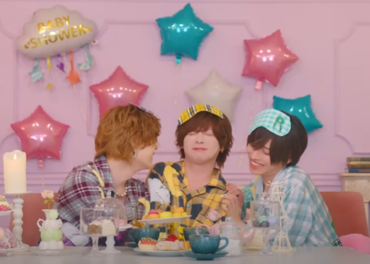

# all about らぶしっく

## quick stats

*   Debut: Aug 7, 2025
*   Members: 9 as of posting
*   concept: pretty boys, menhara, yandere

## bias

 

  
  
<h3>it's hayate, who else would it be but hayate?</h3>
  
this is literally what i look like with he/him pronouns in my bio. Hayate is a perfect example of how gender is whatever the fuck you want it to be. He does <a href="https://youtu.be/q-rW8c2qhwI?t=41">identify as a boy</a> and i love his confidence in expressing himself. he's been in rindo for a long while with other groups and from what i see he seems really professional and hardworking.

  
<blockquote class="tiktok-embed" cite="https://www.tiktok.com/@2yqn_chuuu/video/7531332080811183367" data-video-id="7531332080811183367" style="max-width: 405px;min-width: 111px;" > <section> <a target="_blank" title="@2yqn_chuuu" href="https://www.tiktok.com/@2yqn_chuuu?refer=embed">@2yqn_chuuu</a> つけま難民なのでオススメのアニメっぽい束まつ毛教えてください<a title="らぶしっく" target="_blank" href="https://www.tiktok.com/tag/%E3%82%89%E3%81%B6%E3%81%97%E3%81%A3%E3%81%8F?refer=embed">#らぶしっく</a> <a target="_blank" title="♬ aisarefacedearitai - Love Sick" href="https://www.tiktok.com/music/aisarefacedearitai-7375880326285084673?refer=embed">♬ aisarefacedearitai - Love Sick</a> </section> </blockquote> 

  

## favorite MV

"すとーきんぐ♡LOVE" (Stalking Love) is a perfect combination of how they keep the cute factor up with a bit of edge. I love how hard the refrain goes, i love the weird combination of men in crop tops whacking who also are shooting guns, I love them kidnapping and doing knock off saw with themselves. honestly i can understand this not being for everyone - but those who like this **love this**

<iframe width="560" height="315" src="https://www.youtube-nocookie.com/embed/Lak7HkfRZ9E?si=-X13UNKPzW0Eckiq" title="YouTube video player" frameborder="0" allow="accelerometer; autoplay; clipboard-write; encrypted-media; gyroscope; picture-in-picture; web-share" referrerpolicy="strict-origin-when-cross-origin" allowfullscreen></iframe>

## favorite song

### runner up

<iframe width="560" height="315" src="https://www.youtube-nocookie.com/embed/nWGvSrpXYoI?si=TuACzMV7McWdaLQH" title="YouTube video player" frameborder="0" allow="accelerometer; autoplay; clipboard-write; encrypted-media; gyroscope; picture-in-picture; web-share" referrerpolicy="strict-origin-when-cross-origin" allowfullscreen></iframe>     

I didn't want to give it to stalking love again bc that song goes so hard....while this song is a bit newer I really enjoy it. It's got my hallmarks for a fav song - fast speed, included wota guide, head banging guitar...not sure if it will stand the test of time but i'm allowing it to claim the top spot for today.

### winner

it's a hard world, you can't escape it. don't hold it in, just say it! be selfish!

<iframe width="560" height="315" src="https://www.youtube.com/embed/lEyEPoyd3M0?si=b9hCVRyBz8wCzL55" title="YouTube video player" frameborder="0" allow="accelerometer; autoplay; clipboard-write; encrypted-media; gyroscope; picture-in-picture; web-share" referrerpolicy="strict-origin-when-cross-origin" allowfullscreen></iframe>

I fell in love beat and melody first. the lyrics came later. it's so fun and playful.

## favorite costume

the トランプ (trump) costume

clowncoreclowncoreclowncore!

 

## fun facts

### there is a [baby shower balloon](https://youtu.be/gnO-kEMZwZc?list=RDgnO-kEMZwZc&t=77) on the set for the "グッモニグッナイ" (Good Morning Good Night) music video.

idk who the prop person was for this shoot...i think they saw the word "baby" and thought "oh cute english word" but apparently this is a canonic baby shower....fujoushis go wild with this

