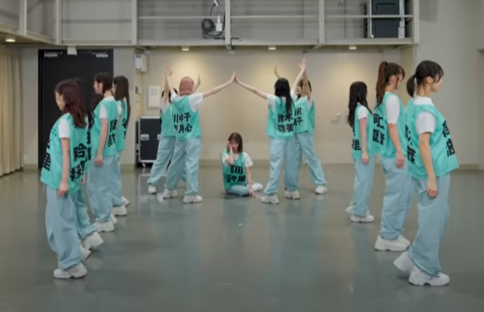
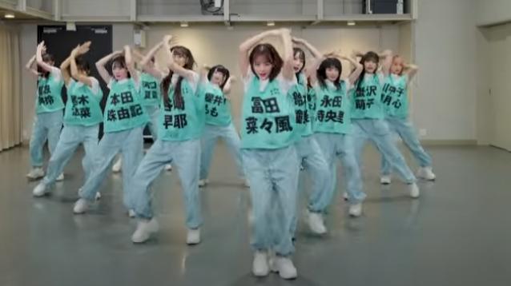
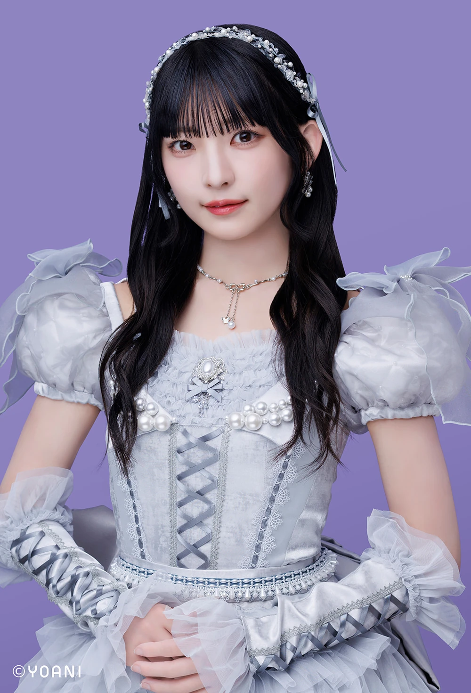
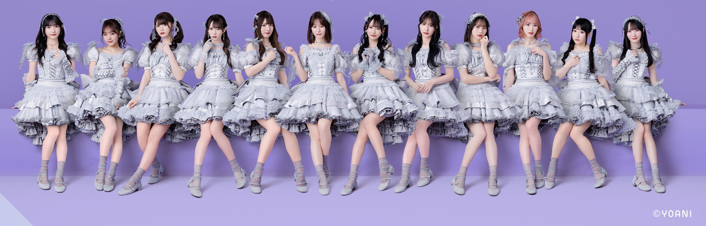

 <iframe width="560" height="315" src="https://www.youtube.com/embed/rifFL1BbZJQ?si=-84VeVuXRUy-moGn" title="YouTube video player" frameborder="0" allow="accelerometer; autoplay; clipboard-write; encrypted-media; gyroscope; picture-in-picture; web-share" referrerpolicy="strict-origin-when-cross-origin" allowfullscreen></iframe>

## quick facts

*   artist: ≠ME (not equal me)
*   released: Apr 11, 2025
*   booking charm point: melancholic lyrics

## music
this song may have changed my mind on how i feel about not equals me. the combined sound of their voices in the refrain fits this song really well. overall the singing quality isn't the best for me, I think it's actually the weakest point of the song overall. so for me to still be able to love their group lines speaks to the overall talent of this group. some voices in the group really nailed the emotion. for example: Momo's line in v2

これで選ばれるって思ってた // i thought this would get you to pick me

she delivers it with so much sadness and heartbreak - i honestly believe her delivery. i wish more of the performers were able to tap into this emotion with their voice, but most of them feel like they don't have complete control over their voices yet. which is a little odd considering they're not a junior group (mid 20s average age). Natsune, the actual youngest of the group (19 as of writing), is even able to deliver a soft tone while her seniors still stick to their comfort cutesy tone. You can't change your voice and i'd never ask an idol to lose what makes her unique - but i do with there was a bit more emotional range.

tbh momo deserved to really be featured more in this song...but what do I know...

<iframe width="560" height="315" src="https://www.youtube.com/embed/S8uY0FhELKg?si=97rUBP2vWMG_OHdx" title="YouTube video player" frameborder="0" allow="accelerometer; autoplay; clipboard-write; encrypted-media; gyroscope; picture-in-picture; web-share" referrerpolicy="strict-origin-when-cross-origin" allowfullscreen></iframe>    
               
## lyrics

but let's get back to loving on these girls okay? that's really the worst i can say about this piece. reminder that when i judge these lyrics I'm going off of general translation and then rhythm. i dont speak japanese as a first language and some of the neuance is going to be lost on me. i'm using the translation from the official mv but [this creator](https://www.youtube.com/@Lumicchi23) was nice enough to put it in a pretty lyric video.

overall this song idea really hits me hard in my teenage feels. i can literally feel 16 year old me reaching out to connect with these lines. didn't all of us always feel like the girl/boy/entity that never got the happy ending? when you're struggling to figure out who you are (and hopped up on hormones) these failures in love can feel like a personal reflection of who you are. I'm not just the boy was told through a third person that the guy i liked was going to prom with his ex-girlfriend...i'm the hideous twink who will never ever be seen as good enough.....hypothetically dw my self-esteem is much better than where i was at 16.

誰かの色が混ざってきて 私だけグレーになっていった // but the colors of others got mixed up with my own, and i alone turned grey

i didn't even need to relate to this idea (it's quite hard to feel like you dont stand out when you're a queer theatre kid in a tiny religious school) to feel the sincerity of the words. I love this imagery of the high of feeling like you're truly expressing your true colors and self, only to be sucked up into the background.

誰かの瞳に映る日を 一人待っているの モブノデレラ // i am waiting alone, a mob Cinderella, for the day i will be relfected in someone's eyes

## mv direction

the visuals and the direction on this mv is what brings us back to stellar territory.

i'm not going to give a full shot by shot analysis - i only have so long left on my lunch break. but i will point out a few powerful moments.

the opening sequence sets the story of disappointment and regrets. wanting to turn back time. coming away empty handed. i think for a video that's going to have a lot of princess fairy tale imagery this is a very mature and dark start to the piece without being overly dramatic.

this entire set location goes too hard. i'm not sure how they were able to make it with the lighting and effects but it reminds me of swan lake. I love that they're outside looking off towards a castle in the distance. it hammers home the isolation and loneliness.

this shot man... this shot hits hard. i genuinely believe the jealousy and loss of this beautiful idol. i love that their cinderella is so etheral and not represented by any of the other girls. the way they crowd around cinderella and are made to look like just bg characters is really well done.

while the "mirror mirror" sections are a little on the nose - they're used appropriately i feel like. I love the very girlhood centric message of "if he didn't pick me there must be something wrong with me". The shattered mirror and glass fit both the aesthetic and storytelling.

I love that there's no happy ending or simple solution. it's just a simple sad story song about rejection and it works.

## choreography

<iframe width="560" height="315" src="https://www.youtube.com/embed/KXNtPmm9nak?si=StVSir8i8k6yzFxk" title="YouTube video player" frameborder="0" allow="accelerometer; autoplay; clipboard-write; encrypted-media; gyroscope; picture-in-picture; web-share" referrerpolicy="strict-origin-when-cross-origin" allowfullscreen></iframe>
           

I want to get it out of the way first that i'm trying to just focus on the artistic concept of the choreography, rather than the member's ability to pull it off. they're idols - not dancers. and to me there's a huge difference seeing as i come from the world of professional dancers (more on this another time). Also when you are performing as an idol esp in japan, you're usually singing live. so I have to keep in mind a lot of movements are probably going to be cut becuase they have to maintain breath support. but let's slurp down that grain of salt and get to the meat of this.

 _this is an unholy iconic formation. this is how you use 12 people_

first 20 seconds in and we're already **moving** like a bat out of hell. i love the fall to the floor, the changing columns. ugh it's so satisfying. the clever formations are honestly one of the stronger parts (with a few exceptions we'll get to). I think this is a good example of how these big groups are trying to make more vertical heavy formations to fit the new tiktok screen rather than the big wide lines of the early 2000's idol groups.

my biggest critique here is coming from a very personal issue. i dont interact with many fans yet to know the details of why or other's opinion on the matter... but here's what i really think. **momo was done so dirty** if you really watch her move she has so much more talent than what they're regulating her to, including nearly [20 seconds of kneeling and facing the back after her solo](https://youtu.be/KXNtPmm9nak?list=RDKXNtPmm9nak&t=114).... yes i counted. let's say what we all know it to be - they didn't want my size L baby girl being featured because she didn't fit their visual. well jokes on them because this song would have popped off 300% more if they weren't so shallow. #justiceformomo

 _what the fuck is she doing back there?!?!?!?_

truly i hope some momo fans come in here to back me up, but her focus and facial acting is so strong. she commits to even the slop parts they give her. she's one of the few girls able to pull off the shoulder isolations in the refrain. her **placement** in all her poses is so accurate. if anything putting her in the back is making her look like she's "over dancing" becuase she's able to hit the moves bigger than some of the weaker ones. i cannot hype this woman up enough she deserves so much more.

more for the actual choreography itself - there's some really pretty floaty moves that look so princessy and beautiful in the chorus, love the [leg flick](https://youtu.be/KXNtPmm9nak?list=RDKXNtPmm9nak&t=69) and a lot of the hip swings back and forth really highlight that girly vibe. my biggest issue has to do with all the hard line angle arms they're using to frame their soloists throughout the dance, it really breaks the energy and makes them look stiff. I would have gone for softer ballet arms if it twere me. there are plenty of moments where they use strong and sharp movements to convey the emotions plenty that it would have made the differences between the soft and hard even more brilliant. the whacking in the dance breakdown has some great symbolism with them looking at mirrors.

## costumes

i would straight up kill a man to wear these. its the perfect fairytale princess ballerina magic girl outfit. it's pays homage to the visual disney beat us over the head without looking like cosplay. i fell like the only possible negative thing I could say about this is that maybe it's itchy to wear. but do our girls let us know this? absolutely not, these champs make the outfits look like marshmellow fluff satin. remember we are all entitled to opinions but my opinions are right and i will not hear otherwise.

let's break it down a bit. we got a princess concept done right here. some members have sheer gloves (see hitomi) and puffy sleeves, very elegant and traiditonal princess. I love the use of pears and broaches in the middle that make it look rich. there's also this cute quilted looking material around the waist band that's making me think of luxury fabrics.

shirori's version has that beautiful corset lacing up the middle and on the sleeves (heyyo coquette girlies). if someone were to make me a princess idol dress i would also want it to heavily incorperate ballerina vibes which this gives. also we love a triangle shape to the front bodice - ya boy needs all the help creating the illusion he has a waist T.T not that im wearing these costumes...or pretending i am...

## overall thoughts

even great pieces will have criticisms from me. honestly the more i have often speaks to how good the piece is that i want to sink my artistic claws into perfecting it. really well done piece, it needed more polish and wouldn't necessarily say ≠ME was the ideal idol group for it... but they did great and i enjoyed it.

